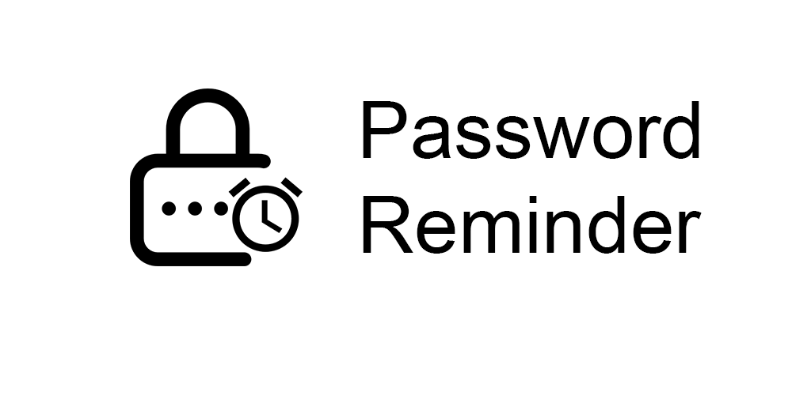

 

Reminds passwords so that you don't forget the ones that you saved the login for.

 

    
    

 

    
    

# Why

The problem with E2EE is if you forget your password, your data is gone forever. Thats where Password Reminder comes in, it will reminder you periodically to check your password against a hashed one.

# Features:

* Passwords are hashed in local storage therfore nobody can retreive passwords from the app.
* Can remind daily, triweekly. biweekly, weekly.
* Dark mode

## Getting Started

you can get the latest release [here](https://github.com/abhinavmarwaha/passwordreminder/releases)

## Issues

* Fixing deep linking in app. (does not open the reminder when clicked on notification)

## Todo

[Roadmap](https://github.com/abhinavmarwaha/passwordreminder/projects/2).

## License

[GPLv3](https://www.gnu.org/licenses/gpl-3.0.en.html)

## You can suppport me at:

<noscript></noscript><a href="https://rzp.io/l/abhinavmarwaha"></img></a>
